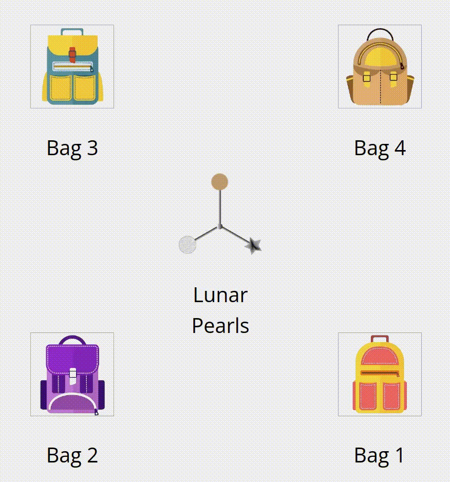

<a id="readme-top"></a>

<!-- PROJECT SHIELDS -->
[![Netlify Status][netlify-shield]][netlify-url]
[![Contributors][contributors-shield]][contributors-url]
[![Forks][forks-shield]][forks-url]
[![Stargazers][stars-shield]][stars-url]
[![Issues][issues-shield]][issues-url]
[![LinkedIn][linkedin-shield]][linkedin-url]
<!-- [![MIT License][license-shield]][license-url] -->


<!-- PROJECT LOGO -->
<br />
<div align="center">
  <a href="https://github.com/rahatzamancse/latent-state-learning-experiment-vite">
    
  </a>

<h3 align="center">Latent State Learning and Context Generalization</h3>

  <p align="center">
    A jsPsych experiment to investigate the latent state learning and context generalization in a simple environment. 
    <br />
    <a href="">View Development Demo</a>
    ·
    <a href="https://github.com/rahatzamancse/latent-state-learning-experiment-vite/issues/new?labels=bug&template=bug-report---.md">Report Bug</a>
    ·
    <a href="https://github.com/rahatzamancse/latent-state-learning-experiment-vite/issues/new?labels=enhancement&template=feature-request---.md">Request Feature</a>
  </p>
</div>


<!-- TABLE OF CONTENTS -->
<details>
  <summary>Table of Contents</summary>
  <ol>
    <li>
      <a href="#about-the-project">About The Project</a>
      <ul>
        <li><a href="#built-with">Built With</a></li>
      </ul>
    </li>
    <li>
      <a href="#getting-started">Getting Started</a>
    </li>
    <li><a href="#contact">Contact</a></li>
  </ol>
</details>


<!-- ABOUT THE PROJECT -->
## About The Project

This is a psychological experiment developed with jsPsych and Vite, to understand the cognitive process and attention variation, behavioral rigidity among the heterogeneity of autism spectrum disorder
(ASD).

<p align="right">(<a href="#readme-top">back to top</a>)</p>

If you need the programming background on how this project (Vite + JsPsych) work, please read the [introduction to Vite+Typescript]() document. Then, to learn about how JsPsych projects can be integrated with a Vite project, see the [Designing Bugless Experiments with Vite+JsPsych]() document.

### Built With

* [JsPsych](https://www.jspsych.org/v7/)
* [TypeScript](https://www.typescriptlang.org/)
* [Vite](https://vitejs.dev/)
* [Google Firestore](https://firebase.google.com/docs/firestore)
* [Netlify](https://www.netlify.com/)
* [PNPM](https://pnpm.io/)

<p align="right">(<a href="#readme-top">back to top</a>)</p>


<!-- GETTING STARTED -->
## Getting Started

### Prerequisites

Make sure you have npm installed
```sh
npm --version
```
If not, follow the steps [here](https://nodejs.org/en/download/package-manager)
Install pnpm
```sh
npm install -g pnpm
```
If you are facing difficulty, follow the steps [here](https://pnpm.io/installation)

### Dependency Installation
Now open a terminal inside the repo and install the dependencies using pnpm
```sh
pnpm install
```

### Development Server
Finally start the dev server
```sh
pnpm run dev
```

### Build
If you want to build the static project, run the following command
```sh
pnpm run build
```

<p align="right">(<a href="#readme-top">back to top</a>)</p>

### Hosting on [Netlify](https://www.netlify.com/) and Datastore on [Google Firestore](https://cloud.google.com/firestore)

Pavlovia is a very popular site for hosting experiments and managing response data on one platform. However, there are better solutions at lower costs if you are able to manually host the site and manage the data yourself.

After running the build command, you will have a folder called `build` that contains all the static HTML, CSS, and JavaScript files needed for your website. You can host these files on any site hosting platform. I have chosen to use Netlify for this purpose. Netlify is a user-friendly platform that allows you to deploy and host your website for free, with generous traffic limits that are usually sufficient for experimental purposes.

Netlify will host your website, making it accessible to users, but it does not provide a database to store response data in its free tier. To store the response data, we use Google Cloud Firestore. Firestore is a flexible, scalable database for mobile, web, and server development from Google Cloud.

To use Firestore, you need to have a Google account. Follow these steps to set it up:
1. Go to the [Firestore Console](https://console.firebase.google.com/).
2. Create a new project or select an existing one.
3. In the Firestore section, create a new database.
4. You will receive an API key, which you will use to connect your website to Firestore.

The API key is stored in the `.env.local` file in the root of the project. For security reasons, it is not included in the repository. That env file also includes some other variables that can control the project behavior. Here is a sample env file:

```bash
VITE_FIREBASE_API_KEY=<API_KEY> # The API key for the Firestore database
VITE_LOCAL_TESTING=true         # Set to true if you want to run the experiment locally
VITE_DEBUGGING=true             # Speeds some trials up by removing the time constraints, helpful while debugging

VITE_PROLIFIC=false             # Set to true if you want to use Prolific as the participant ID provider, you need to add the id to the src/main.ts file
VITE_TRACK_EYE=false            # Set to true if you want to track the eye movements
VITE_UPLOAD_FIRESTORE=false     # Set to true if you want to upload the response data to Firestore
VITE_AUDIO=true                 # Set to true if you want to play audio files
VITE_DOWNLOAD_AT_END=true       # Set to true if you want to download the response data at the end of the experiment
```

With the API key, you can use Firestore's JavaScript API to connect to the real-time database and store the response data from your experiments. This setup allows you to have full control over your data and hosting environment, often at a lower cost than using an all-in-one platform like Pavlovia.


### Top contributors:

<a href="https://github.com/rahatzamancse/latent-state-learning-experiment-vite/graphs/contributors">
  
</a>


<!-- CONTACT -->
## Contact

Rahat Zaman - rahatzamancse@gmail.com

Project Link: [https://github.com/rahatzamancse/latent-state-learning-experiment-vite](https://github.com/rahatzamancse/latent-state-learning-experiment-vite)

<p align="right">(<a href="#readme-top">back to top</a>)</p>


<!-- MARKDOWN LINKS & IMAGES -->
<!-- https://www.markdownguide.org/basic-syntax/#reference-style-links -->
[netlify-shield]: https://api.netlify.com/api/v1/badges/7d76e534-072c-47a1-94f2-e7009c3e1ee6/deploy-status
[contributors-shield]: https://img.shields.io/github/contributors/rahatzamancse/latent-state-learning-experiment-vite.svg?style=for-the-badge
[netlify-url]: https://app.netlify.com/sites/latent-state-learning-experiment/deploys
[contributors-url]: https://github.com/rahatzamancse/latent-state-learning-experiment-vite/graphs/contributors
[forks-shield]: https://img.shields.io/github/forks/rahatzamancse/latent-state-learning-experiment-vite.svg?style=for-the-badge
[forks-url]: https://github.com/rahatzamancse/latent-state-learning-experiment-vite/network/members
[stars-shield]: https://img.shields.io/github/stars/rahatzamancse/latent-state-learning-experiment-vite.svg?style=for-the-badge
[stars-url]: https://github.com/rahatzamancse/latent-state-learning-experiment-vite/stargazers
[issues-shield]: https://img.shields.io/github/issues/rahatzamancse/latent-state-learning-experiment-vite.svg?style=for-the-badge
[issues-url]: https://github.com/rahatzamancse/latent-state-learning-experiment-vite/issues
[license-shield]: https://img.shields.io/github/license/rahatzamancse/latent-state-learning-experiment-vite.svg?style=for-the-badge
[license-url]: https://github.com/rahatzamancse/latent-state-learning-experiment-vite/blob/master/LICENSE.txt
[linkedin-shield]: https://img.shields.io/badge/-LinkedIn-black.svg?style=for-the-badge&logo=linkedin&colorB=555
[linkedin-url]: https://linkedin.com/in/rahatzamancse
[product-screenshot]: images/screenshot.png
[Next.js]: https://img.shields.io/badge/next.js-000000?style=for-the-badge&logo=nextdotjs&logoColor=white
[Next-url]: https://nextjs.org/
[React.js]: https://img.shields.io/badge/React-20232A?style=for-the-badge&logo=react&logoColor=61DAFB
[React-url]: https://reactjs.org/
[Vue.js]: https://img.shields.io/badge/Vue.js-35495E?style=for-the-badge&logo=vuedotjs&logoColor=4FC08D
[Vue-url]: https://vuejs.org/
[Angular.io]: https://img.shields.io/badge/Angular-DD0031?style=for-the-badge&logo=angular&logoColor=white
[Angular-url]: https://angular.io/
[Svelte.dev]: https://img.shields.io/badge/Svelte-4A4A55?style=for-the-badge&logo=svelte&logoColor=FF3E00
[Svelte-url]: https://svelte.dev/
[Laravel.com]: https://img.shields.io/badge/Laravel-FF2D20?style=for-the-badge&logo=laravel&logoColor=white
[Laravel-url]: https://laravel.com
[Bootstrap.com]: https://img.shields.io/badge/Bootstrap-563D7C?style=for-the-badge&logo=bootstrap&logoColor=white
[Bootstrap-url]: https://getbootstrap.com
[JQuery.com]: https://img.shields.io/badge/jQuery-0769AD?style=for-the-badge&logo=jquery&logoColor=white
[JQuery-url]: https://jquery.com 